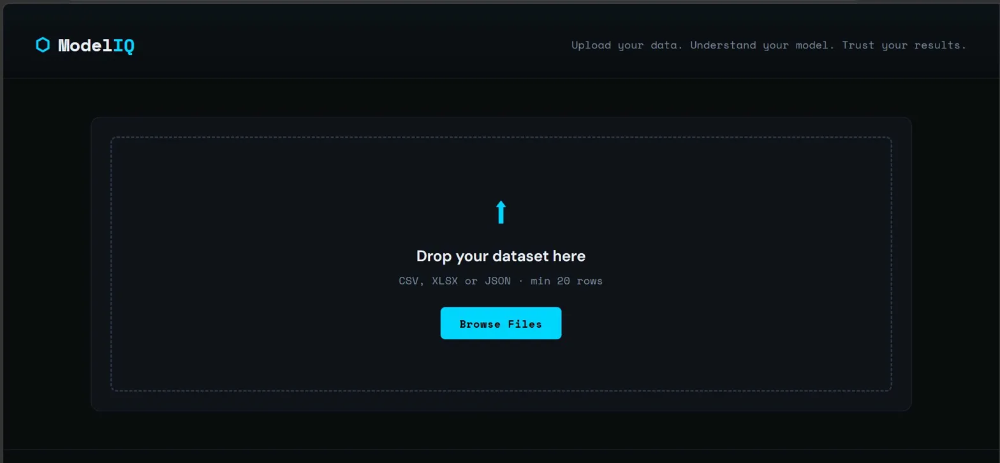
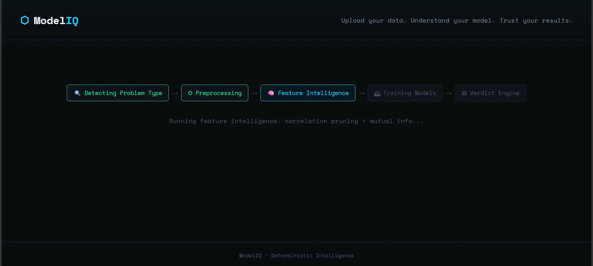
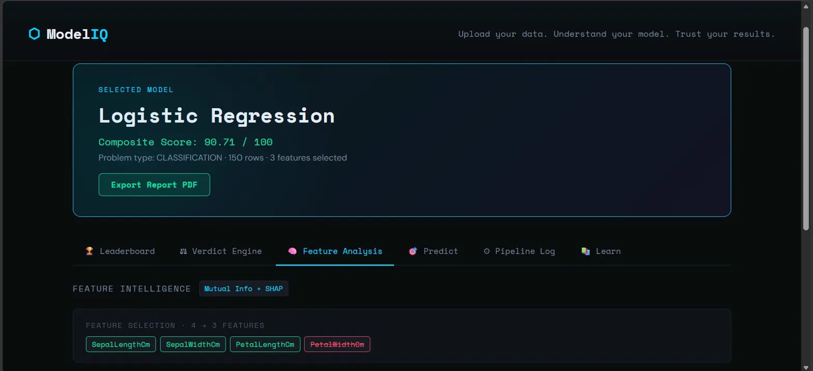
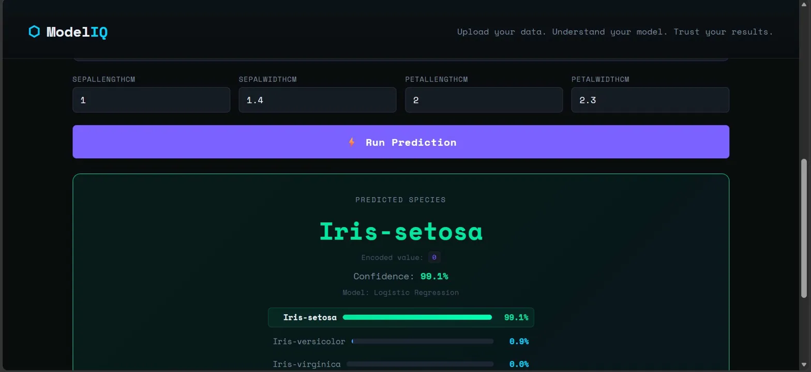

# ⬡ ModelIQ — Explainable AutoML Advisor

> **Deterministic Intelligence. Zero LLMs at runtime.**  
> Upload a dataset. Get a fully explainable model recommendation with traceable logic — no black boxes, no AI APIs in the loop.

---

## Screenshots

### Upload Interface

*Drop any CSV, XLSX, or JSON file onto the upload zone — minimum 20 rows required.*

### Pipeline in Progress

*Live pipeline animation showing each stage: Problem Detection → Preprocessing → Feature Intelligence → Training → Verdict Engine.*

### Feature Analysis & Selected Model

*The winning model (Logistic Regression, 90.71/100) with SHAP + Mutual Info feature intelligence. PetalWidthCm was pruned via correlation analysis.*

### Live Prediction

*Run live inference through the winning model — here predicting Iris-setosa with 99.1% confidence using Logistic Regression.*

### Sample Analysis Report (PDF)
A full multi-page PDF report is exported after every analysis. Below is a sample run on the insurance charges dataset:

📄 **[View Sample Report → docs/reports/ModelIQ_Report_Gradient_Boosting.pdf](docs/reports/ModelIQ_Report_Gradient_Boosting.pdf)**

**Report highlights (insurance dataset, 1338 rows, regression):**
- **Selected model:** Gradient Boosting — Composite Score 85.56 / 100
- **R²:** 0.852 · **MAE:** 2539.09 · **Overfit gap:** 5.3%
- **Top feature:** `smoker` (SHAP importance 7911.84) — by far the strongest predictor
- Runner-up: Decision Tree scored 77.58 (margin: 7.98 points)

---

## Table of Contents

- [Overview](#overview)
- [How It Works](#how-it-works)
- [Architecture](#architecture)
- [Tech Stack](#tech-stack)
- [Project Structure](#project-structure)
- [Getting Started](#getting-started)
- [Module Reference](#module-reference)
- [Scoring Formula](#scoring-formula)
- [API Endpoints](#api-endpoints)
- [Hackathon Alignment](#hackathon-alignment)

---

## Overview

ModelIQ is an **explainable AutoML advisor** that accepts any tabular dataset (CSV, XLSX, JSON), runs it through a deterministic intelligence pipeline, and recommends the best machine learning model — with full transparency into *why* that model was chosen.

Every decision in the system is rule-based and auditable. There are no LLM calls, no generative AI, and no nondeterministic outputs at runtime.

**What ModelIQ does for you:**

- Automatically detects whether your problem is classification or regression
- Cleans and preprocesses your data using logged, rule-based steps
- Selects the most informative features using mutual information and correlation analysis
- Trains 5 candidate models using honest 5-fold cross-validation
- Scores each model across 5 dimensions using a hand-designed rubric
- Explains the winning model's feature importance using SHAP values
- Lets you run live predictions through the winning model
- Exports a full multi-page PDF analysis report

---

## How It Works

```
Upload CSV/XLSX/JSON
        │
        ▼
┌─────────────────────┐
│  Problem Detector   │  Rule engine → Classification or Regression
└─────────────────────┘
        │
        ▼
┌─────────────────────┐
│    Preprocessor     │  Drop high-missing cols → Impute → Encode → Scale
└─────────────────────┘
        │
        ▼
┌─────────────────────┐
│ Feature Intelligence│  Low-variance filter → Correlation pruning → MI ranking
└─────────────────────┘
        │
        ▼
┌─────────────────────┐
│   Model Trainer     │  5-fold CV on 5 candidates → collect metrics
└─────────────────────┘
        │
        ▼
┌─────────────────────┐
│   Verdict Engine    │  Weighted rubric → composite score → winner
└─────────────────────┘
        │
        ▼
┌─────────────────────┐
│  Explainability     │  SHAP TreeExplainer / LinearExplainer → feature ranks
└─────────────────────┘
        │
        ▼
    Results UI  +  PDF Report  +  Live Predict
```

---

## Architecture

```
modeliq/
├── backend/
│   ├── main.py                      # FastAPI app — /api/columns, /api/analyze, /api/predict
│   ├── requirements.txt
│   └── modules/
│       ├── problem_detector.py      # Rule-based classification vs regression detection
│       ├── preprocessor.py          # Deterministic cleaning, imputation, encoding, scaling
│       ├── feature_intelligence.py  # Variance filter, correlation pruning, mutual info ranking
│       ├── model_trainer.py         # 5-fold CV training of 5 sklearn models
│       ├── verdict_engine.py        # THE BRAIN — weighted scoring rubric, disqualification rules
│       └── explainability.py        # SHAP values + native feature importances
│
└── frontend/
    ├── index.html                   # Single-page UI
    ├── app.js                       # All UI logic, tab rendering, PDF export
    └── style.css                    # Dark-theme design system
```

---

## Tech Stack

| Layer | Technology |
|---|---|
| Backend | Python 3.10+, FastAPI, Uvicorn |
| ML | scikit-learn (models, CV, preprocessing, MI) |
| Explainability | SHAP (TreeExplainer, LinearExplainer) |
| Data | pandas, numpy, scipy |
| Frontend | Vanilla HTML/CSS/JS (zero framework) |
| PDF Export | jsPDF (client-side, no server dependency) |

**No LLMs. No generative AI APIs. No nondeterministic outputs at runtime.**

---

## Project Structure

```
modeliq/
├── .gitignore
├── README.md
├── docs/
│   ├── screenshots/
│   │   ├── upload.png
│   │   ├── pipeline.png
│   │   ├── feature_analysis.png
│   │   └── predict.png
│   └── reports/
│       └── ModelIQ_Report_Gradient_Boosting.pdf
├── backend/
│   ├── main.py
│   ├── requirements.txt
│   └── modules/
│       ├── problem_detector.py
│       ├── preprocessor.py
│       ├── feature_intelligence.py
│       ├── model_trainer.py
│       ├── verdict_engine.py
│       └── explainability.py
└── frontend/
    ├── index.html
    ├── app.js
    └── style.css
```

---

## Getting Started

### Prerequisites

- Python 3.10 or higher
- pip

### Installation

```bash
# 1. Clone the repository
git clone https://github.com/your-username/modeliq.git
cd modeliq

# 2. Create and activate a virtual environment
python -m venv venv
source venv/bin/activate        # Windows: venv\Scripts\activate

# 3. Install backend dependencies
cd backend
pip install -r requirements.txt

# 4. Start the backend server
python main.py
# Server runs at http://localhost:8000
```

### Usage

1. Open `http://localhost:8000` in your browser
2. Drop any CSV, XLSX, or JSON file onto the upload zone (minimum 20 rows)
3. Select the **target column** (the column you want to predict)
4. Click **Analyze Dataset**
5. Explore the results across six tabs:
   - **Leaderboard** — ranked composite scores for all models
   - **Verdict Engine** — dimension-by-dimension scoring breakdown
   - **Feature Analysis** — SHAP values and mutual information rankings
   - **Predict** — live inference form using the winning model
   - **Pipeline Log** — every preprocessing decision, logged and traceable
   - **Learn** — ML roadmap and plain-English glossary
6. Click **Export Report PDF** for a full multi-page analysis report

### Supported File Formats

| Format | Extension |
|---|---|
| CSV | `.csv` |
| Excel | `.xlsx`, `.xls` |
| JSON | `.json` |

Minimum dataset size: **20 rows**.

---

## Module Reference

### `problem_detector.py`

Determines whether the target column is a **classification** or **regression** problem using a 4-rule priority engine:

| Rule | Condition | Decision |
|---|---|---|
| Rule 1 | dtype is object / bool / category | Classification |
| Rule 2 | ≤ 2 unique values | Classification (binary) |
| Rule 3 | ≤ 20 unique values AND unique ratio ≤ 5% | Classification |
| Rule 4 | Default (high cardinality numeric) | Regression |

---

### `preprocessor.py`

Applies transformations in fixed order. Every step is logged with its rule and rationale.

| Step | Action | Rule |
|---|---|---|
| 1 | Separate target | — |
| 2 | Drop high-missing columns | Drop if > 50% missing |
| 3 | Drop high-cardinality categoricals | Drop if > 20 unique values |
| 4 | Numeric imputation | Fill NaN with column median |
| 5 | Label encoding | Map each category string to integer |
| 6 | Target encoding | Encode classification labels to integers |
| 7 | Feature scaling | StandardScaler (zero mean, unit variance) |

---

### `feature_intelligence.py`

Three-stage deterministic feature selection:

1. **Low Variance Filter** — drops features with variance < 0.001 (near-constant, no signal)
2. **Correlation Pruning** — drops one feature from pairs with |correlation| > 0.90 (redundant)
3. **Mutual Information Ranking** — scores each remaining feature's predictive power relative to the target (model-agnostic, captures non-linear relationships)

---

### `model_trainer.py`

Trains 5 candidate models using 5-fold cross-validation. All seeds fixed at 42.

**Classification candidates:** Logistic Regression, Decision Tree, Random Forest, Gradient Boosting, K-Nearest Neighbors

**Regression candidates:** Ridge Regression, Decision Tree, Random Forest, Gradient Boosting, K-Nearest Neighbors

Metrics collected per model: test accuracy / R², train accuracy / R², macro F1 / MAE, overfit gap, training time, interpretability score.

---

### `verdict_engine.py` — The Deterministic Brain

The core of ModelIQ. Scores every model across 5 dimensions using fixed weights and rule tables.

**Classification formula:**
```
Composite = (accuracy × 0.30) + (f1_macro × 0.30) + (overfit_penalty × 0.25)
          + (speed × 0.05) + (interpretability × 0.10)
```

**Regression formula:**
```
Composite = (r2 × 0.35) + (mae_score × 0.30) + (overfit_penalty × 0.25)
          + (speed × 0.05) + (interpretability × 0.05)
```

**Disqualification rules (hard gates before scoring):**

| Rule | Condition |
|---|---|
| DQ1 | Accuracy < 50% (classification) |
| DQ2 | R² < 0.0 (regression) |
| DQ3 | Overfit gap > 25% |
| DQ4 | Model training failed |

---

### `explainability.py`

Generates post-hoc explanations for the winning model:

- **SHAP TreeExplainer** — for Random Forest, Gradient Boosting, Decision Tree
- **SHAP LinearExplainer** — for Logistic Regression, Ridge Regression
- **Native feature importances** — Gini-based (tree models) or coefficient magnitude (linear models)

SHAP is deterministic given a fixed model and fixed data. No randomness introduced.

---

## Scoring Formula

### Classification

| Dimension | Weight | Source |
|---|---|---|
| CV Accuracy | 0.30 | `test_accuracy` from 5-fold CV |
| Macro F1 | 0.30 | `test_f1_macro` from 5-fold CV |
| Overfit Penalty | 0.25 | `1 - penalty(train_acc - test_acc)` |
| Speed | 0.05 | Binned by training time (seconds) |
| Interpretability | 0.10 | Hand-scored 1–10, normalised to 0–1 |

### Regression

| Dimension | Weight | Source |
|---|---|---|
| R² Score | 0.35 | `test_r2` from 5-fold CV |
| MAE Score | 0.30 | Normalised inverse MAE across all models |
| Overfit Penalty | 0.25 | `1 - penalty(train_r2 - test_r2)` |
| Speed | 0.05 | Binned by training time (seconds) |
| Interpretability | 0.05 | Hand-scored 1–10, normalised to 0–1 |

### Overfit Penalty Table

| Train/Test Gap | Penalty | Label |
|---|---|---|
| ≤ 2% | 0% | No overfitting |
| 2–5% | 10% | Slight |
| 5–10% | 25% | Moderate |
| 10–20% | 50% | High |
| > 20% | 80% | Severe |

---

## API Endpoints

| Method | Endpoint | Description |
|---|---|---|
| GET | `/health` | Health check |
| POST | `/api/columns` | Upload file → get column names and preview |
| POST | `/api/analyze` | Upload file + target → run full pipeline, return results |
| POST | `/api/predict` | JSON inputs → prediction from winning model |

### Example: `/api/analyze`

**Request:** `multipart/form-data` with `file` and `target_col`

**Response (abbreviated):**
```json
{
  "status": "success",
  "problem_detection": { "problem_type": "classification", "rule_triggered": "Rule 3: Low cardinality" },
  "preprocessing": { "steps": [...] },
  "feature_analysis": { "selected_features": [...], "importance_ranking": [...] },
  "verdict": {
    "winner": "Random Forest",
    "leaderboard": [...],
    "verdicts": { "Random Forest": { "composite_score": 0.8724, "dimension_scores": {...} } }
  },
  "explanations": { "shap_available": true, "shap_values": [...] }
}
```

---

## Hackathon Alignment

This project was built for the **CodeWiser × VJTI Hackathon 2026** — *"AI Without the API: Deterministic Intelligence"*.

### Domain

**Domain 2 — Career Systems** (also overlaps Domain 1 — Learning Systems via the Learn tab)

ModelIQ helps users make informed decisions about which machine learning model to use for their data, with full transparency — directly supporting career readiness and data literacy.

### Deterministic Intelligence Techniques Used

| Technique | Where Used |
|---|---|
| **Rules Engine** | Problem Detector (4-rule priority chain), Preprocessor (threshold rules), Disqualification rules in Verdict Engine |
| **Scoring System** | Verdict Engine — 5-dimension weighted rubric with fixed weight tables |
| **Decision Trees** | Overfit penalty table, speed scoring table (rule-based binning) |
| **Data Models** | All model training uses sklearn with fixed random seeds — deterministic by design |
| **Retrieval & Ranking** | Feature Intelligence (MI-based ranking), Leaderboard (composite score ranking) |
| **State Machines** | 5-stage pipeline with logged transitions: Detect → Preprocess → Select → Train → Verdict |

### Constraint Compliance

| Constraint | Status |
|---|---|
| No LLM/generative AI API calls at runtime | ✅ Fully compliant |
| No Ollama or local LLM at runtime | ✅ Fully compliant |
| No nondeterministic model outputs for core experience | ✅ All seeds fixed (random_state=42), deterministic CV |
| No hidden model inference | ✅ All logic is in source code, every decision is logged |
| AI permitted during development only | ✅ Compliant |

### Judging Rubric Self-Assessment

| Category | Points | Our Approach |
|---|---|---|
| Intelligence Design (30) | Full | Multi-layer rule engine: problem detection → preprocessing rules → feature selection → weighted scoring rubric → disqualification gates |
| Problem Framing (20) | Full | Real target user: any data analyst or student with a CSV who wants to understand which model to use and why, without needing ML expertise |
| Explainability (20) | Full | Every preprocessing step logged with rule + rationale; full dimension-score breakdown per model; SHAP values trace predictions to features; PDF report |
| Correctness (15) | Full | Fixed seeds, 5-fold CV, deterministic transformations, consistent pipeline order |
| Technical Depth (10) | Full | Modular backend (6 independent modules), FastAPI, SHAP integration, multi-format file handling, session-based prediction |
| Communication (5) | Full | Pipeline animation, tabbed results UI, plain-English Learn tab, exportable PDF |